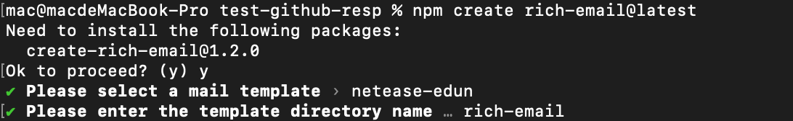

# create-rich-email <a href="https://npmjs.com/package/create-rich-email"></a> <a href="https://github.com/yassine-zhang/create-rich-email/blob/main/LICENSE"></a>

It provides you with a variety of beautiful rich text mail templates that you can use in your project development with only a few simple modifications.

<p align="center">
    
</p>

## Install

```shell
npm create rich-email@latest
```

Note that the tag name (@latest or @legacy) MUST NOT be omitted, otherwise npm may resolve to a cached and outdated version of the package.

## Template Preview

Template path: `./template/...`

- [netease-edun](./template/netease-edun/网易易盾.PNG)
- tencent-cloud
- docker
- etc...

## LICENSE

Use [MIT](./LICENSE) license.
